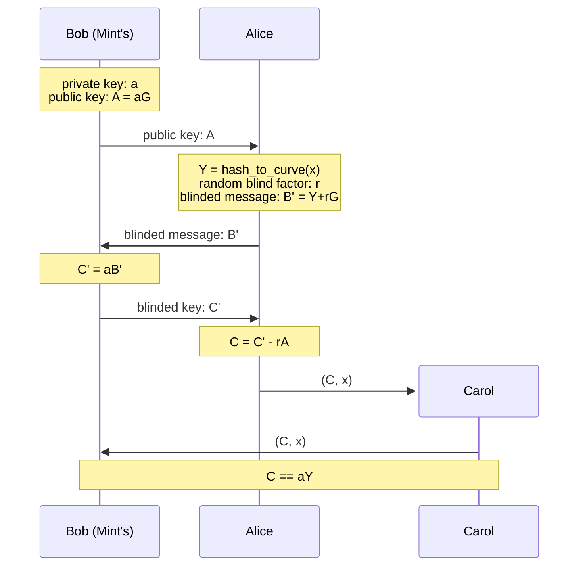

Cashu Payment Methods
---

# Overview

I will show how Cashu payments works, explaining how mint and melt operations works using lightning payments and how we can implement this with Bitcoin payments.

<!-- end_slide -->
<!-- alignment: center -->
<!-- jump_to_middle -->
NUT-00: Cryptography and Models
---
<!-- end_slide -->

NUT-00: Cryptography and Models
---

Cashu implements Chaumian Ecash protocol, that uses **Blind Diffie-Hellmann Key Exchange** to create valid signatures for a blinded secret.

To understand how Cashu works, we need to understand this protocol.

<!-- pause -->

1. The Mint's *Bob* publish your public key: `K = kG`
2. The user *Alice* picks a secret `x` and computes a valid point in the curve for that: `Y = hash_to_curve(x)`
3. *Alice* creates a nonce `r`, computes the blinded secret `B' = Y + rG` and sends it's to Mint's *Bob*
4. *Bob* signs this blinded secret with `C' = kB'` and sends it's to *Alice*.
5. *Alice* now can calculate the unblinded signature from Mint's: `C = C' - rK`
6. *Alice* now have the pair `(x, C)` as a token, that can send to another user *Carol*.
7. *Carol* can send `(x, C)` to *Bob* Mint's who then checks that `kY == C`
  - If so, treats it as valid spend of token, adding `x` to list of spent secrets.



<!-- end_slide -->
NUT-00: Cryptography and Models
---

In Cashu protocol we work like that, but slightly different.

To explain how it works, let's split this into two operations:

* Mint
* Melt

<!-- end_slide -->
<!-- alignment: center -->
<!-- jump_to_middle -->
NUT-04: Mint tokens
---
<!-- end_slide -->
NUT-04: Mint tokens
---

Mint operation in Cashu is a two-step process, we need to request a quote, pay that and mint using this paid quote.

Let's see the workflow of mint new tokens operation:

<!-- pause -->

1. The wallet requests a mint quote specifying the `unit` and the payment `method` that will be used.

```http
POST https://mint.host:3338/v1/mint/quote/{method}
```
```json
{
  "unit":  "" // <str_enum[UNIT]>
}
```

<!-- pause -->

2. The mint responds with a `quote` and a payment `request` that user need to pay.

```json
{
  "quote": "", // <str>
  "request": "", // <str>
  "unit":  "" // <str_enum[UNIT]>
}
```

<!-- pause -->

3. The user needs to pay the `request` using the payment method specified before.
<!-- pause -->
4. The wallet then requests minting of new tokens with the paid `quote` id and blinded secrets in `outputs`.

```http
POST https://mint.host:3338/v1/mint/{method}
```
```json
{
  "quote": "", // <str>
  "outputs": [] // <Array[BlindedMessage]>
}
```
<!-- pause -->
5. The Mint verifies the payment and returns the blinded signatures for `outputs`.

```json
{
  "signatures": "<Array[BlindSignature]>"
}
```


<!-- end_slide -->
<!-- alignment: center -->
<!-- jump_to_middle -->
NUT-05: Melting tokens
---
<!-- end_slide -->
NUT-05: Melting tokens
---

Melting tokens is the opposite of minting tokens. It's a two-step process too: requesting a melt quote and melt tokens.

Let's see the workflow:

<!-- pause -->

1. The Wallet requests a melt quote, specifying the payment `method`, the `unit` that wants to receive and the payment `request` that mint needs to pay.

```http
POST https://mint.host:3338/v1/melt/quote/{method}
```
```json
{
  "request": "", // <str>
  "unit": "" // <str_enum[UNIT]>
}
```

<!-- pause -->
2. The Mint responds with a `quote` and an `amount` demanded by `unit`.
```json
{
  "quote": "", // <str>
  "amount": 0, // <int>
  "unit": "", // <str_enum[UNIT]>
  "state": "", // <str_enum[STATE]>
  "expiry": 0, // <int>
}
```

<!-- pause -->
3. The Wallet sends a melting request with `quote` and `inputs` of required `amount`
```html
POST https://mint.host:3338/v1/melt/{method}
```
```json
{
  "quote": "", //<str>
  "inputs": [], // <Array[Proof]>
}
```

<!-- pause -->
4. The Mint executes the payment and responds with the payment `state` and some proof of payment.

<!-- end_slide -->
<!-- alignment: center -->
<!-- jump_to_middle -->
Payment Methods
---
<!-- end_slide -->
Payment Methods
---

NUT-04 and NUT-05 specified what we need to do if want to add a new payment method.

1. Define the method-specific request and response structures following the same pattern from NUT-04 and NUT-05.
2. Implement the three required endpoints: quote request, quote check and mint execution.
3. Update the settings to include the new method.
4. Document any method-specific fields or behaviors that differ from the general flow.

<!-- pause -->

Following this flow, we can see how the two available payment methods in Cashu works:

* Bolt11
* Bolt12

And a new method is on development and review:
* Onchain payments

<!-- end_slide -->
<!-- alignment: center -->
<!-- jump_to_middle -->
NUT-23: BOLT11
---
<!-- end_slide -->
NUT-23: BOLT11
---

For the Bolt 11 payment method, we use NUT-04 and NUT-05 same patterns:

<!-- pause -->

## Mint Quote
The wallet sends a Mint Quote request:
```http
POST http://mint.host:3338/v1/mint/quote/bolt11
```
```json
{
  "amount": 21,
  "unit": "sat"
}
```

<!-- pause -->

The Mint will respond with `request` as a bolt11 invoice:
```json
{
  "quote": "DSGLX9kevM...",
  "request": "lnbc100n1pj4apw9...",
  "amount": 10,
  "unit": "sat",
  "state": "UNPAID",
  "expiry": 1701704757
}
```

<!-- end_slide -->
NUT-23: BOLT11
---

## Mint

<!-- pause -->

Once user paid the bolt11 invoice, he can use the `quote` to mint new tokens:
```http
POST https://mint.host:3338/v1/mint/bolt11
```
```json
{
  "quote": "DSGLX9kevM...",
  "outputs": [
    {
      "amount": 8,
      "id": "009a1f293253e41e",
      "B_": "035015e6d7ade60ba8426cefaf1832bbd27257636e44a76b922d78e79b47cb689d"
    },
    {
      "amount": 2,
      "id": "009a1f293253e41e",
      "B_": "0288d7649652d0a83fc9c966c969fb217f15904431e61a44b14999fabc1b5d9ac6"
    }
  ]
}
```

<!-- pause -->

The Mint will respond with `signatures` for each `output`:
```json
{
  "signatures": [
    {
      "id": "009a1f293253e41e",
      "amount": 2,
      "C_": "0224f1c4c564230ad3d96c5033efdc425582397a5a7691d600202732edc6d4b1ec"
    },
    {
      "id": "009a1f293253e41e",
      "amount": 8,
      "C_": "0277d1de806ed177007e5b94a8139343b6382e472c752a74e99949d511f7194f6c"
    }
  ]
}
```

<!-- end_slide -->
NUT-23: BOLT11
---

For melting operation, we just implement the same method defined in NUT-05, but with bolt11 invoice payments.

<!-- pause -->

## Melt Quote
The Wallet sends to Mint a melt quote request:
```http
POST https://mint.host:3338/v1/melt/quote/bolt11
```
```json
{
  "request": "lnbc100n1p3kdrv5sp5lpdxzghe5j67q...",
  "unit": "sat"
}
```

<!-- pause -->

The Mint will respond with `quote` details:
```json
{
  "quote": "TRmjduhIsPxd...",
  "request": "lnbc100n1p3kdrv5sp5lpdxzghe5j67q...",
  "amount": 10,
  "unit": "sat",
  "fee_reserve": 2,
  "state": "UNPAID",
  "expiry": 1701704757
}
```

<!-- end_slide -->
NUT-23: BOLT11
---

## Melt

<!-- pause -->

The Mint will pay the bolt11 invoice, and the Wallet can do a melt request to Mint:
```http
POST https://mint.host:3338/v1/melt/bolt11
```
```json
{
  "quote": "od4CN5smMMS3K3QVHkbGGNCTxfcAIyIXeq8IrfhP",
  "inputs": [...]
}
```

<!-- pause -->

The Mint will respond with the `quote` and `preimage_payment` that's the proof of payment:
```json
{
  "quote": "TRmjduhIsPxd...",
  "request": "lnbc100n1p3kdrv5sp5lpdxzghe5j67q...",
  "amount": 10,
  "unit": "sat",
  "fee_reserve": 2,
  "state": "PAID",
  "expiry": 1701704757,
  "payment_preimage": "c5a1ae1f639e1f4a3872e81500fd028bece7bedc1152f740cba5c3417b748c1b"
}
```

<!-- end_slide -->
<!-- alignment: center -->
<!-- jump_to_middle -->
NUT-25: BOLT12
---
<!-- end_slide -->
NUT-25: BOLT12
---

The Bolt12 payment method is like NUT-23 from Bolt11, but we have some differences:

<!-- pause -->

## Mint Quote
For Mint Quote request, we have a new required field `pubkey` that the Wallet **SHOULD** generate a unique public key for each mint quote request.

```http
POST http://localhost:3338/v1/mint/quote/bolt12
```
```json
{
  "amount": 10,
  "unit": "sat",
  "pubkey": "03d56ce4e446a85bbdaa547b4ec2b073d40ff802831352b8272b7dd7a4de5a7cac"
}
```

<!-- pause -->

The response from Mint's is different too, now we have a two new fields `amount_paid` and `amount_issued`:
```json
{
  "quote": "DSGLX9kevM...",
  "request": "lno1qcp...",
  "amount": 10,
  "unit": "sat",
  "expiry": 1701704757,
  "pubkey": "03d56ce4e446a85bbdaa547b4ec2b073d40ff802831352b8272b7dd7a4de5a7cac",
  "amount_paid": 0,
  "amount_issued": 0
}
```

<!-- pause -->

This enables multiple payments per quote, the Mint **MUST** accept mint requests whose total output amount is less than or equal to `amount_paid` - `amount_issued`.

<!-- end_slide -->
NUT-25: BOLT12
---
## Mint

<!-- pause -->

Mint request and response is the same format as Bolt11:
```http
POST https://mint.host:3338/v1/mint/bolt12
```
```json
{
  "quote": "DSGLX9kevM...",
  "outputs": [
    {
      "amount": 8,
      "id": "009a1f293253e41e",
      "B_": "035015e6d7ade60ba8426cefaf1832bbd27257636e44a76b922d78e79b47cb689d"
    },
    {
      "amount": 2,
      "id": "009a1f293253e41e",
      "B_": "0288d7649652d0a83fc9c966c969fb217f15904431e61a44b14999fabc1b5d9ac6"
    }
  ]
}
```

<!-- pause -->

The Mint will respond with:
```json
{
  "signatures": [
    {
      "id": "009a1f293253e41e",
      "amount": 2,
      "C_": "0224f1c4c564230ad3d96c5033efdc425582397a5a7691d600202732edc6d4b1ec"
    },
    {
      "id": "009a1f293253e41e",
      "amount": 8,
      "C_": "0277d1de806ed177007e5b94a8139343b6382e472c752a74e99949d511f7194f6c"
    }
  ]
}
```
<!-- end_slide -->
NUT-25: BOLT12
---
## Melt Quote

<!-- pause -->

Melt Quote from Bolt12 follows the same pattern from Bolt11, the difference is that request needs to be a Bolt12 invoice
```http
POST https://mint.host:3338/v1/melt/quote/bolt12
```
```json
{
  "request": "lno1qcp4256ypqpq86q69t5wv5629arxqurn8cxg9p5qmmqy2e5xq...",
  "unit": "sat"
}
```

<!-- pause -->

The response will be the same too
```json
{
  "quote": "TRmjduhIsPxd...",
  "request": "lno1qcp4256ypqpq86q69t5wv5629arxqurn8cxg9p5qmmqy2e5xq...",
  "amount": 10,
  "unit": "sat",
  "fee_reserve": 2,
  "state": "UNPAID",
  "expiry": 1701704757
}
```

<!-- end_slide -->
NUT-25: BOLT12
---
## Melt

<!-- pause -->

The melt request follows the same structure as Bolt11
```http
POST https://mint.host:3338/v1/melt/bolt12
```
```json
{
  "quote": "TRmjduhIsPxd...",
  "inputs": [...]
}
```

<!-- pause -->

And response follows the same structure
```json
{
  "quote": "TRmjduhIsPxd...",
  "request": "lno1qcp4256ypqpq86q69t5wv5629arxqurn8cxg9p5qmmqy2e5xq...",
  "amount": 10,
  "unit": "sat",
  "fee_reserve": 2,
  "state": "PAID",
  "expiry": 1701704757,
  "payment_preimage": "c5a1ae1f639e1f4a3872e81500fd028bece7bedc1152f740cba5c3417b748c1b"
}
```

<!-- end_slide -->
<!-- alignment: center -->
<!-- jump_to_middle -->
(WIP) NUT-XX: Payment Method: Onchain
---
<!-- end_slide -->
(WIP) NUT-XX: Payment Method: Onchain
---

The onchain payment method it's still being discussed and developing.

The approach for bitcoin payment method follows the same struct of other methods.

<!-- pause -->

## Mint Quote

For onchain method, the Wallet needs to include a `pubkey` field, like Bolt12 method:
```http
POST http://mint.host:3338/v1/mint/quote/onchain
```
```json
{
  "unit": "sat",
  "pubkey": "03d56ce4e446a85bbdaa547b4ec2b073d40ff802831352b8272b7dd7a4de5a7cac"
}
```

<!-- pause -->

The response follows the struct from Bolt12 method too, but with `request` as a Bitcoin address
```json
{
  "quote": "DSGLX9kevM...",
  "request": "bc1qxy2kgdygjrsqtzq2n0yrf2493p83kkfjhx0wlh",
  "unit": "sat",
  "expiry": 1701704757,
  "pubkey": "03d56ce4e446a85bbdaa547b4ec2b073d40ff802831352b8272b7dd7a4de5a7cac",
  "amount_paid": 100000,
  "amount_issued": 0
}
```

<!-- end_slide -->
(WIP) NUT-XX: Payment Method: Onchain
---
## Mint

To mint new tokens using onchain payment method, the user can send funds to address that receive from mint quote. Each Mint has a setting for minimum number of confirmations.

<!-- pause -->

Since the transaction reaches the minimum number of confirmations defined by Mint, the Wallet can mint new tokens following the struct request from bolt12
```http
POST https://mint.host:3338/v1/mint/onchain
```
```json
{
  "quote": "DSGLX9kevM...",
  "outputs": [
    {
      "amount": 50000,
      "id": "009a1f293253e41e",
      "B_": "035015e6d7ade60ba8426cefaf1832bbd27257636e44a76b922d78e79b47cb689d"
    },
    {
      "amount": 50000,
      "id": "009a1f293253e41e",
      "B_": "0288d7649652d0a83fc9c966c969fb217f15904431e61a44b14999fabc1b5d9ac6"
    }
  ]
}
```

<!-- pause -->

The Mint response follows the same struct for others payment methods
```json
{
  "signatures": [
    {
      "id": "009a1f293253e41e",
      "amount": 50000,
      "C_": "0224f1c4c564230ad3d96c5033efdc425582a5a7691d600202732edc6d4b1ec"
    },
    {
      "id": "009a1f293253e41e",
      "amount": 50000,
      "C_": "0277d1de806ed177007e5b94a8139343b6382e472c752a74e99949d511f7194f6c"
    }
  ]
}
```

<!-- end_slide -->
(WIP) NUT-XX: Payment Method: Onchain
---
## Multiple Deposits

Onchain address can receive multiple payments, this allows the Wallet to Mint multiple times for just one quote.

If another payment is sent to same address from quote and reaches the required confirmations, the Wallet can mint additional tokens.

Following the Bolt12 method, the Mint **MUST** accept mint requests whose total output amount is less than or equal to `amount_paid` - `amount_issued`.

<!-- pause -->

Using last example:
```json
{
  "quote": "DSGLX9kevM...",
  "request": "bc1qxy2kgdygjrsqtzq2n0yrf2493p83kkfjhx0wlh",
  "unit": "sat",
  "expiry": 1701704757,
  "pubkey": "03d56ce4e446a85bbdaa547b4ec2b073d40ff802831352b8272b7dd7a4de5a7cac",
  "amount_paid": 150000,
  "amount_issued": 100000
}
```
The Wallet can mint additional 50000 sats worth of ecash.

<!-- end_slide -->
(WIP) NUT-XX: Payment Method: Onchain
---
## Melt Quote

<!-- pause -->

The Melt Quote request follows the same struct for Bolt12 method, with `request` field as a Bitcoin address
```http
POST https://mint.host:3338/v1/melt/quote/onchain
```
```json
{
  "request": "bc1qxy2kgdygjrsqtzq2n0yrf2493p83kkfjhx0wlh",
  "unit": "sat",
  "amount": 100000
}
```

<!-- pause -->

The Mint will respond with the quotes
```json
[
  {
    "quote": "TRmjduhIsPxd...",
    "request": "bc1qxy2kgdygjrsqtzq2n0yrf2493p83kkfjhx0wlh",
    "amount": 100000,
    "unit": "sat",
    "fee": 5000,
    "estimated_blocks": 1,
    "state": "UNPAID",
    "expiry": 1701704757
  },
  {
    "quote": "OewtRaqeXmzK...",
    "request": "bc1qxy2kgdygjrsqtzq2n0yrf2493p83kkfjhx0wlh",
    "amount": 100000,
    "unit": "sat",
    "fee": 2000,
    "estimated_blocks": 6,
    "state": "UNPAID",
    "expiry": 1701704757
  },
  {
    "quote": "KfPqNghzLvtY...",
    "request": "bc1qxy2kgdygjrsqtzq2n0yrf2493p83kkfjhx0wlh",
    "amount": 100000,
    "unit": "sat",
    "fee": 800,
    "estimated_blocks": 144,
    "state": "UNPAID",
    "expiry": 1701704757
  }
]
```

The Wallet needs to select one of the returned quotes.

<!-- end_slide -->
(WIP) NUT-XX: Payment Method: Onchain
---
## Melt

<!-- pause -->

The Melt request follows the same struct as the others methods
```http
POST https://mint.host:3338/v1/melt/onchain
```
```json
{
  "quote": "TRmjduhIsPxd...",
  "inputs": [...]
}
```

<!-- pause -->

And Mint will respond with:
```json
{
  "quote": "TRmjduhIsPxd...",
  "request": "bc1qxy2kgdygjrsqtzq2n0yrf2493p83kkfjhx0wlh",
  "amount": 100000,
  "unit": "sat",
  "fee": 5000,
  "estimated_blocks": 1,
  "state": "PENDING",
  "expiry": 1701704757,
  "outpoint": "3b7f3b85c5f1a3c4d2b8e9f6a7c5d8e9f1a2b3c4d5e6f7a8b9c1d2e3f4a5b6c7:2"
}
```

<!-- pause -->

After payment reaches the minimum confirmations, the Mint returns with an updated `state` value:
```json
{
  "quote": "TRmjduhIsPxd...",
  "request": "bc1qxy2kgdygjrsqtzq2n0yrf2493p83kkfjhx0wlh",
  "amount": 100000,
  "unit": "sat",
  "fee": 5000,
  "estimated_blocks": 1,
  "state": "PAID",
  "expiry": 1701704757,
  "outpoint": "3b7f3b85c5f1a3c4d2b8e9f6a7c5d8e9f1a2b3c4d5e6f7a8b9c1d2e3f4a5b6c7:2"
}
```

<!-- end_slide -->
<!-- end_slide -->
References
---

- [NUT-00: Notation, Utilization, and Terminology](https://github.com/cashubtc/nuts/blob/main/00.md)
- [NUT-04: Mint tokens](https://github.com/cashubtc/nuts/blob/main/04.md)
- [NUT-05: Melting tokens](https://github.com/cashubtc/nuts/blob/main/05.md)
- [NUT-23: BOLT11](https://github.com/cashubtc/nuts/blob/main/23.md)
- [NUT-25: BOLT12](https://github.com/cashubtc/nuts/blob/main/25.md)
- [NUT-XX: Payment Method: Onchain](https://github.com/thesimplekid/nuts/blob/17057a2c0b8f87d3595752f54234175373c849ea/XX.md)


<!-- end_slide -->
<!-- alignment: center -->
<!-- jump_to_middle -->
Questions?
---

<!-- end_slide -->
<!-- alignment: center -->
<!-- jump_to_middle -->
That's all Folks!
---
